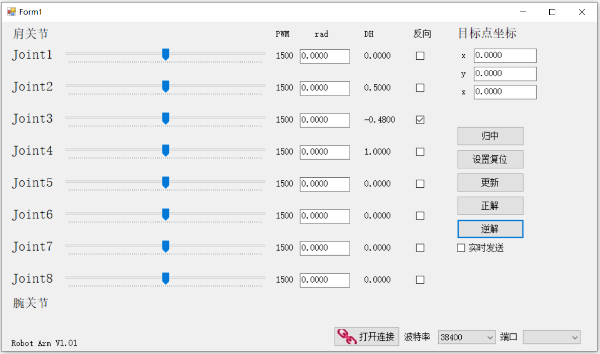

# RobotArm

舵机机械臂上位机程序
版本 V1.03

## 使用说明

release中下载armUI.exe、ForwardSolve.dll、InverseSolve.dll三个文件，使用时须放在同一个目录。

### 文件说明

该仓库为完整的vs2019解决方案，包含3个项目：
* armUI: c#上位机项目，用于生成机械臂UI界面；
* ForwardSolve: c++动态链接库项目，用于计算机械臂正运动学；
* InverseSolve: c++动态链接库项目，用于计算机械臂逆运动学。

### 坐标系

世界坐标系固定于地面，固定坐标系固定于机械臂原点。
机械臂mcu61的固定坐标系相对于世界坐标系向z轴正方向平移93mm。

### 界面

界面从左到右分别为：关节名称、舵机PWM拖动条、舵机PWM显示、舵机rad角度、关节DH参数中的θ参数、舵机反向勾选框、目标点坐标和指令按钮。  
以下所指的DH参数均指代关节DH参数中的θ参数。  
关节名称：共8个关节，暂时用到4个，从上到下为从肩关节到腕关节。  
舵机反向勾选框：默认舵机PWM增加将使关节DH参数增加，如果相反，则勾选该舵机的反向勾选框。  

按钮从上到下分别为：归中、设置复位、更新、正解、逆解、实时发送。  
* 归中  
拖动条归中，PWM恢复1500，角度归零，DH参数恢复舵机归中时的值。  
* 设置复位  
将舵机rad角度文本框中的角度设置为舵机归中时的DH参数，  
并将PWM恢复1500，角度归零。  
将文本框中的值限制在正负3.1416(180°)之间。  
* 更新  
将舵机角度文本框中的角度转换成舵机PWM值并更新PWM拖动条和DH参数。  
将文本框中的值限制在正负0.7854(45°)之间。  
* 正解  
调用动态链接库ForwardSolve.dll，根据DH参数计算机械臂正运动学，将计算出来的结果显示于目标点坐标。  
* 逆解  
调用动态链接库InverseSolve.dll，根据目标点坐标计算机械臂逆运动学，并更新舵机PWM和角度值。  

### 舵机归中与设置复位的进一步说明

如图所示为mcu61机械臂的侧视图，此时机械臂的各个舵机均为归中状态，但4个关节的DH参数分别约为  
0、0.5、-0.48、1，不为0的原因是为了尽可能充分地利用机械臂的操作空间。